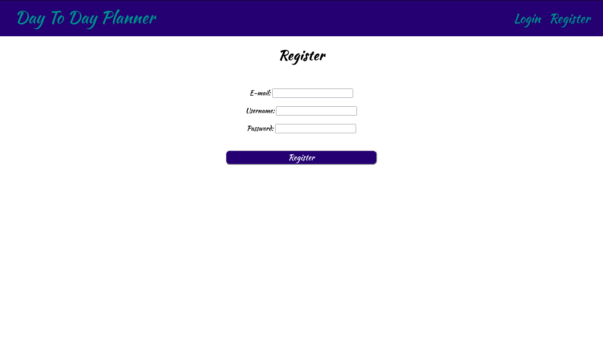
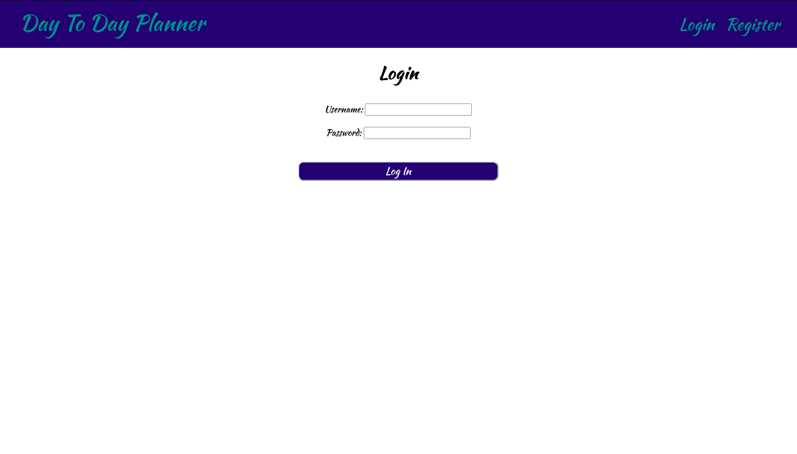
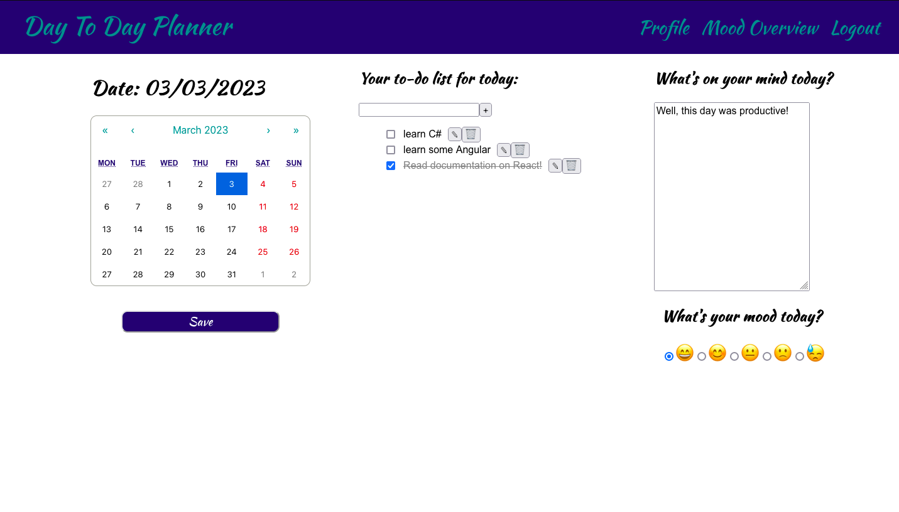
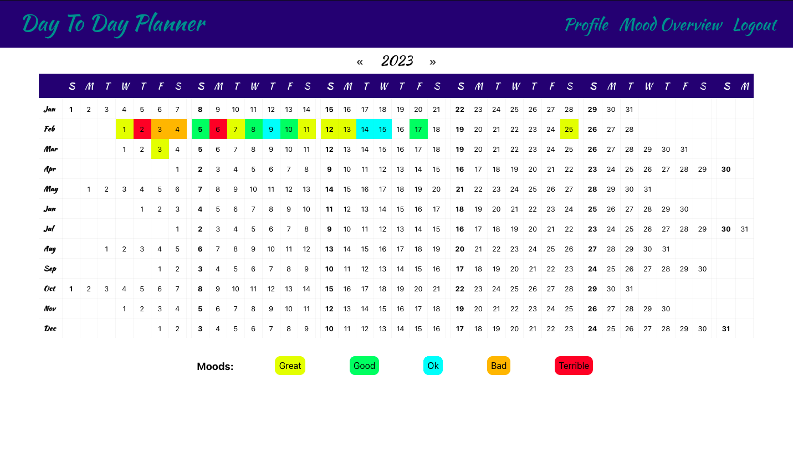

# Day to Day Planner

A day-to-day planner is a web application, where the user can add a to-do list, a diary entry and track their mood for each day. The goal for this project is to help people to organize their day-to-day life. 


## Dependencies

**Frontend:** Node

**Backend:** Maven3, Java 17

**Database:**  Postgres

## Technologies

Spring Boot, Spring Security, Spring Data JPA, Spring 

## Run Locally

Clone the project

```bash
  git clone https://github.com/ikapata/day-to-day-planner 
```

Go to the project directory

```bash
  cd day-to-day-planner
```

### Docker
The easiest way to start the app is using docker-compose. 
You only need Docker installed!

You can build and run the docker images (using the docker-compose.yml file).
To start the app run:
```bash
  docker compose up
```
 
Or you can use the already build images from Docker Hub (using the docker-compose-images.yml):
```bash
  docker compose -f docker-compose-images.yml up
```

The app will be available at http://localhost:3000!


### Frontend

The other option is to run the frontend and backend separately. 

Install dependencies

```bash
  cd frontend/day-to-day-planner
  npm install
```

Start react on port 3000.

```bash
  npm start
```

### Backend

First, you have to export the SPRING_DATASOURCE_URL, SPRING_DATASOURCE_USERNAME, SPRING_DATASOURCE_PASSWORD as your environment variables. 
Then run with Maven:

```bash
  cd backend/day-to-day-planner
  mvn spring-boot:run
```

It will start the server on port 8080.


## Screenshots







## Roadmap

- [x]  Setup project
- [x]  Add Spring Security and Users
- [x]  Test backend (more blackbox, whitebox tests to come!)
- [x]  Add frontend
- [x]  Dockerize
- [x]  Mood Tracker Page
- [ ]  Profile Page
- [ ]  Google Sync

Stay tuned for more features in the future!

