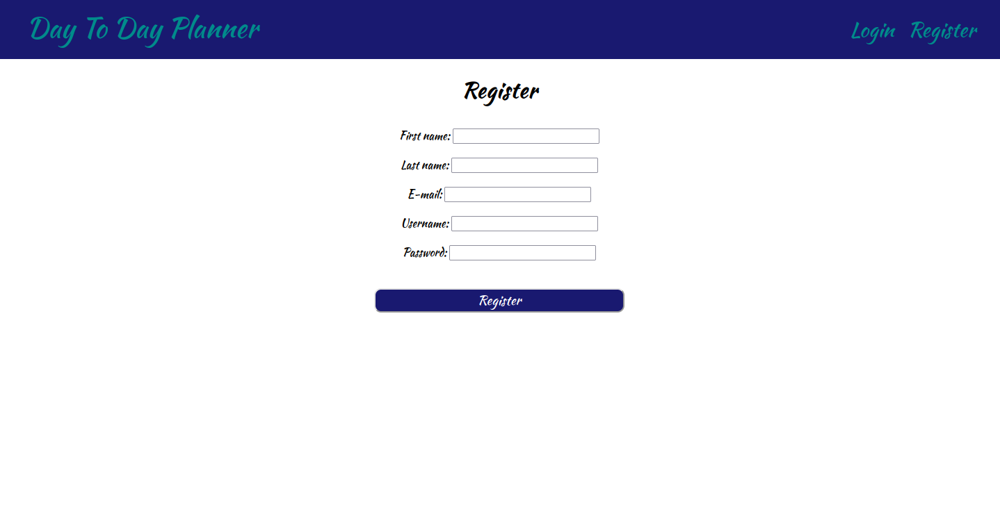
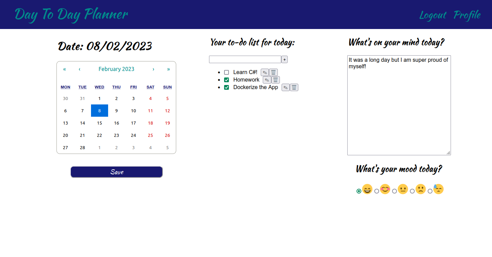

# Day to Day Planner

A day-to-day planner, where the user can add a to-do list, a diary entry and track their mood for each day. 


## Dependencies

**Frontend:** Node

**Backend:** Maven3, Java 17

**Database:**  Postgres

## Run Locally

Clone the project

```bash
  git clone https://github.com/ikapata/day-to-day-planner 
```

Go to the project directory

```bash
  cd day-to-day-planner
```

### Docker
The easiest way to start the app is using docker-compose. 
You only need Docker installed!
To start the app run:
```bash
  docker compose up
```
The app will be available at http://localhost:3000!


### Frontend

Install dependencies

```bash
  cd frontend/day-to-day-planner
  npm install
```

Start react on port 3000.

```bash
  npm start
```

### Backend

Add your database name, user and password to the application.yml file. Then run with Maven:

```bash
  cd backend/day-to-day-planner
  mvn spring-boot:run
```

It will start the server on port 8080.


## Screenshots






## Roadmap

- [x]  Setup project
- [x]  Add Spring Security and Users 
- [x]  Add frontend
- [x]  Test backend
- [x]  Dockerize
- [ ]  Profile Page
- [ ]  Google synchronisation

